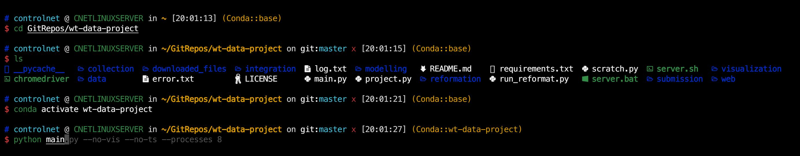

# my-zsh-theme-env
A script to fast build my zsh theme environment

It supports the following distributions:
- Ubuntu and Mint
- Redhat, CentOS, ...
- Manjaro

What tools will be installed:
- The basic development tools (vim, wget, git, ...)
- Install zsh as the default shell
- A theme (modified mzz-ys) for zsh with oh-my-zsh
- Frequently used languages and package managers (python with conda, nodejs, rust, golang, ...)
- Modern linux terminal tools (exa, bat, fd, ripgrep, lazygit, lunarvim, ...) with alias



## How to use it
```shell
curl -fsSL https://boot.controlnet.space/ | bash
```

### For docker

```dockerfile
# Setup environment
RUN sh -c "$(wget -O- https://github.com/deluan/zsh-in-docker/releases/download/v1.1.5/zsh-in-docker.sh)" -- \
    -t robbyrussell \
    -p https://github.com/zsh-users/zsh-autosuggestions \
    -p https://github.com/zsh-users/zsh-syntax-highlighting

# download theme
RUN curl -fsSL https://raw.githubusercontent.com/ControlNet/my-zsh-theme-env/main/files/mzz-ys.zsh-theme > /root/.oh-my-zsh/themes/mzz-ys.zsh-theme

# modify the .zshrc file to change the theme and add plugins
RUN cat /root/.zshrc | sed 's/ZSH_THEME=\"robbyrussell\"/ZSH_THEME=\"mzz-ys\"\nZSH_DISABLE_COMPFIX=\"true\"/' \
    | sed 's/plugins=(git)/plugins=(git zsh-autosuggestions zsh-syntax-highlighting)/' > /root/temp.zshrc
RUN mv /root/temp.zshrc /root/.zshrc

# setup git alias
RUN git config --global alias.lsd "log --graph --decorate --pretty=oneline --abbrev-commit --all"

# hide conda prefix
RUN echo "changeps1: false" >> /root/.condarc
```

### Detail Steps

1. Checks the Linux distribution and installs a set of common development tools using the appropriate package manager.
2. Installs pipx, a tool for installing and running Python applications in isolated environments.
3. Downloads and installs bat, a cat clone with syntax highlighting and Git integration.
4. Installs Node.js using nvm (Node Version Manager).
5. Downloads and installs ctop, a top-like interface for container metrics.
6. Installs neofetch, a command-line system information tool.
7. Sets up tmux with a specific color scheme.
8. Installs oh-my-zsh, a framework for managing Zsh configuration.
9. Changes the default shell to Zsh.
10. Downloads a specific Zsh theme and modifies the .zshrc file to use this theme and add plugins.
11. Disables oh-my-zsh auto-update notifications.
12. Installs additional Zsh plugins for autosuggestions and syntax highlighting.
13. Sets up Git history visualization and credential storage.
14. Installs Miniconda, a free minimal installer for conda.
15. Sets up the Rust programming language and Go programming language environments.
16. Installs lazygit, a simple terminal UI for git commands.
17. Installs neovim, a highly configurable text editor.
18. Sets up LunarVim, a distribution of Neovim.
19. Installs a faster solver for conda.
20. Installs the Meslo font.
21. Installs Docker and sets up the user to run Docker commands without sudo.
22. Installs lazydocker, a simple terminal UI for Docker.
23. Installs lemonade, a remote operation utility.
24. Installs ZeroTier, a global P2P VPN.
25. Installs several utilities (lsd, git-delta, duf, dust, fd, ripgrep, gping, procs, xh, uv, speedtest-cli, gdown, zoxide, micro, scc, viu, pm2) and sets up aliases for some of them.
26. Installs several system monitoring tools (bottom, nvitop, bpytop, bandwhich).
